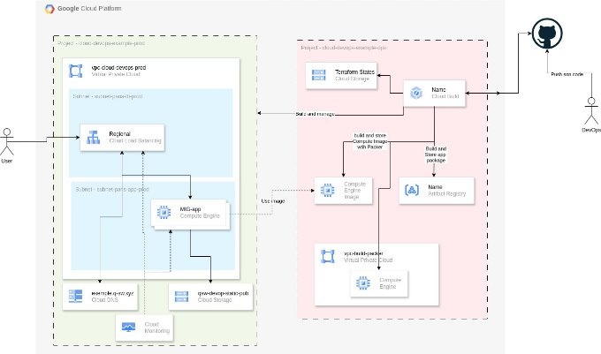

# CESI-OPS

Architecture

Consignes

Projet Ops

Le projet Ops servira uniquement à construire et manager l'infrastructure applicatif.

Chaque point ci-dessous représente une pipeline Cloud Build différente!

1. Build automatique du binaire applicatif et le stockager dans **Artefact Registry** Le code applicatif est fait en Go, il faudra donc créer une registry Go.

   Dans la Pipeline les étapes suivantes soivent apparaitre:

- Scan de sécurité afin de véfier que des secrets ne sont pas leak
- Scan de securité afin de vérfier que l'application n'inclue pas de vulnérabilité
- Build du binaire et Push dans Artefact Registry
2. Construire à l'aide de **packer** et **ansible** l'image système qui sera deployé plus tard. Cette image doit inclure :
- l'application qui est sous la forme d'un binaire, et qui doit etre executer en tant que service **systemd**
- l'OpsAgent

Pensez à inclure les pré-requis au bon fonctionnement de packer.

3. Créer un Bucket GCS non public qui hébergera les terraform states.

Projet App

Le projet App hebergera l'ensemble des services nécessaire au bon fonctionnement de l'application. L'infrastructure est composée de:

- 1 VPC
- 1 sous-réseau dans la région Paris (europe-west9)
- 1 sous-réseau de type Load balancer Only
- 1 Bucket GCS public pour héberger les fichiers static (html/css/js) ainsi que les images de l'application.
- 1 Manage Instance Group (MIG) utilisant l'image précédement créer dans le projet Ops.
- 1 load Balancer régional afin d'exposer l'application. Ce load balancer sera deployé dans le sous- reseau créé à cet effet.
- 1 zone DNS
- 1 Dasboard Cloud Monitoring affichant les informations:
  - du traffic venant du load balancer
    - CPU / RAM venant du MIG.

Le déploiement et le management de cette infrastructure sera réalisé à l'aide du **projet ops** via la **CI/CD** et **Terraform**
2 / 2